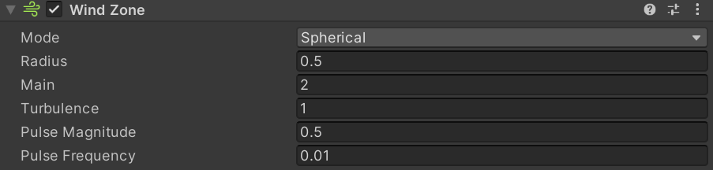
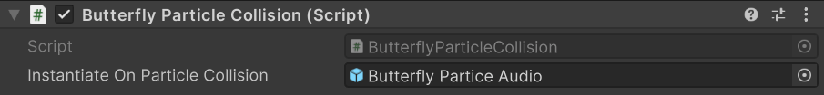
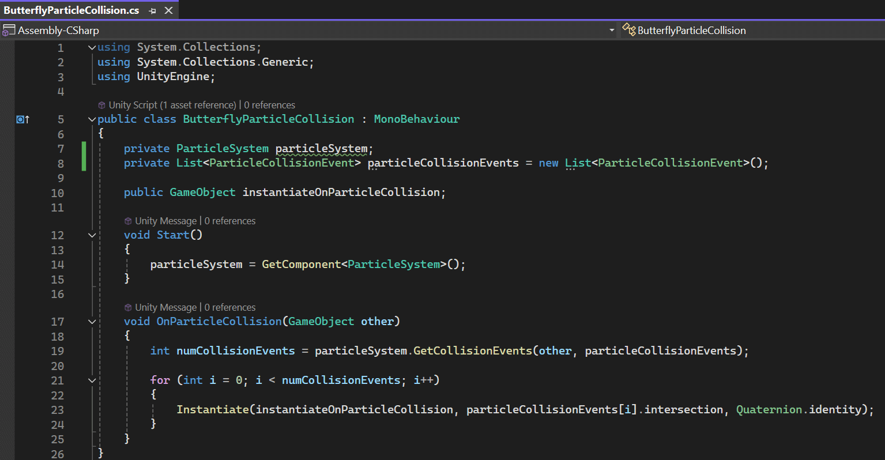

    <h1>Interactive Butterfly Effect</h1>
    
 

    
An interactive butterfly effect created in Unity, where butterflies gracefully flutter around and will be drawn to the approaching player. Upon contact, these fragile, otherworldly butterflies emit an ethereal sound, dissolve into soft glimmer and gradually disappear, creating an immersive and dreamlike experience. The effect is designed to enhance the atmosphere of the scene, providing a captivating interaction within a subtle nighttime environment.

    [video here]

## Table of Contents <!-- omit from toc -->
- [Inspiration](#inspiration)
- [Key Features](#key-features)
- [Implementation Details](#implementation-details)
  - [Simple Environmental Setup](#simple-environmental-setup)
  - [Butterfly Particle System](#butterfly-particle-system)
  - [Interaction Mechanics](#interaction-mechanics)
- [Future Work](#future-work)
- [References](#references)

## Inspiration
The inspiration for this project came from the serene and mysterious atmosphere of summer nights, where fireflies light up the darkness and moths are drawn to the flames. However, I chose butterflies for their aesthetic appeal and elegance. Aiming to enhance the immersive atmosphere of the scene, I created an interactive effect, allowing the player to experience a magical moment where butterflies respond to the player's presence.

## Key Features
- Interactive butterfly effect that reacts to player proximity
- Fairytale collision and disappearance mechanics for the butterflies
- Ethereal sound effects with randomized pitch and volume variations upon collisions
- Custom trail textures and UV animations for butterfly wings

 

## Implementation Details

### Simple Environmental Setup

- **Dynamic Skybox:** Adjusted the time and weather settings of a dynamic skybox asset to create a nighttime atmosphere.

- **Model Adjustments:** Modified pivot points of models, split models as needed, and corrected inverted normals in Blender.

- **Lantern Lighting:** Added a light source and halo effect to the lanterns, enhancing their glow within the scene.

- **Background Music:** Placed an audio source at the lantern's location to play soft, dreamlike background music that reinforces the mystical atmosphere.

### Butterfly Particle System
1. **Basic Particle Settings:** Created a particle system at the lantern’s location to simulate butterflies. Set up basic parameters such as `Start Lifetime`, `Start Size`, and `Shape` as a sphere. Configured `Limit Velocity over Lifetime`, `Size over Lifetime`, and added `Noise` for more natural movement. Enabled the `Lights` module, making each butterfly a small light source. 
 

2. **Custom Textures and Animations:** Used Photoshop to create a trail texture and a sprite sheet for the the butterfly animation. Applied these to the particle system, with rendering mode set to `Stretched Billboard` and trai texture mode to `Stretch`. 
  

    - **Discarded Solution for Wing Flapping Effect:** Initially, I considered using `Mesh` render mode with a simple plane mesh with half of a butterfly texture (the part other than it being transparent) to simulate wing flapping through rotation around the longitudinal axis of the butterfy's body, combined with another alomost the same except mirrored particle system to fake complete butterflies, so that I could keep the model simple and effect more realistic at the same time. However, this approach caused issues with collisions, where the two wing halves would separate upon impact, leading to unrealistic results. Therefore, I abandoned this method in favor of the current approach of `Texture Sheet Animation`. 

3. **External Forces and Wind Zones:** Enabled `External Forces` and placed a spherical wind zone at the lantern’s location (another spherical wind zone was set up on the player to attract butterflies as they approach). 
 

4. **Collision and Sub Emitters:** Enabled `Collision` for the particles, setting the lifetime loss to 1 upon impact. Configured `Sub Emitters` to spawn a new particle (a glowing orb) upon collision, with the size shrinking over its lifetime until it disappears. 

### Interaction Mechanics
- **Player Attraction Mechanism:** Set a collider for the player armature and add a wind zone on it to attract butterflies to the player when they entered a certain range. 
 

- **Scripted Sound Effects:** Wrote a script to play a wind chime sound when butterflies collide with the player. Randomized pitch and volume to ensure that each butterfly collision produced a unique sound. 
   

## Future Work
In the future, I plan to explore the use of shaders to create the butterfly wing-flapping effect based on a plane mesh through vertex animation. This approach will allow for more control over the animation and create more natural and fluid wing movements in 3D.

## References
[1] https://www.youtube.com/watch?v=41hAlLk8AiQ