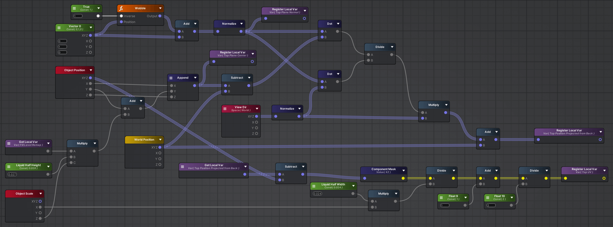
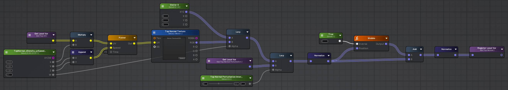
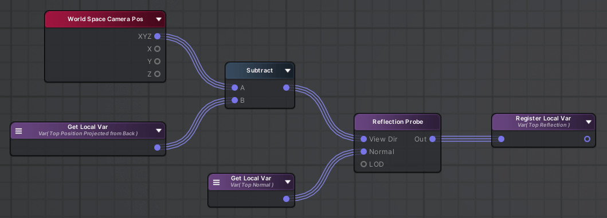
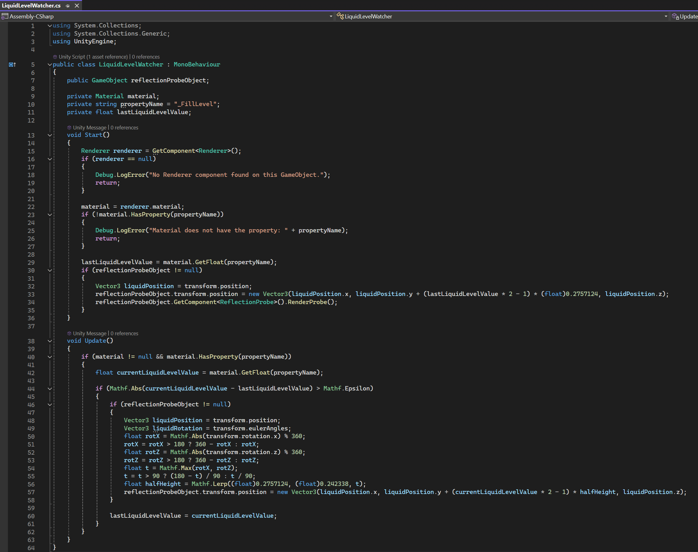
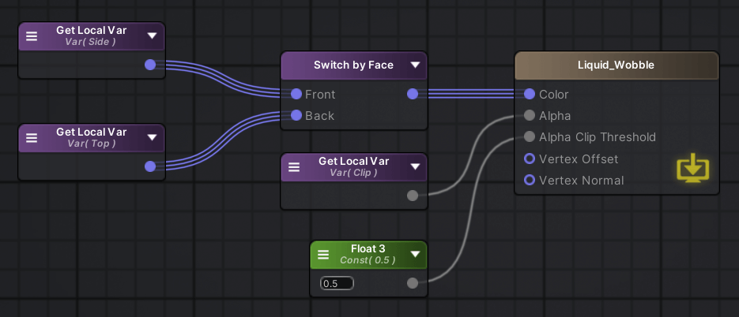

    <h1>Interactive Bottled Liquid Material</h1>
    
 

    
An interactive, deceptive bottled liquid shader with a realistic rendering style, created in Unity URP. The liquid dynamically responds to the motion of the bottle, simulating wobbling and waves, while featuring authentic liquid characteristics such as refraction and reflection. 

    

## Table of Contents <!-- omit from toc -->
- [Inspiration](#inspiration)
- [Key Features](#key-features)
- [Investigation](#investigation)
- [Implementation Details](#implementation-details)
  - [Wobble, Waves, and Clipping](#wobble-waves-and-clipping)
  - [Side Surface](#side-surface)
  - [Top Surface (Main Challenge)](#top-surface-main-challenge)
  - [Output Switching](#output-switching)
- [Future Work](#future-work)
- [References](#references)

## Inspiration
The inspiration for this project came from the incredibly realistic liquid in the boozy bottles of Half-Life: Alyx. The effect wasn't physically simulating fluid but was instead using clever tricks to deceive the player's eyes, which I found both fascinating and ingenious. Additionally, I noticed that most bottled liquid shader tutorials online focus on stylized, cartoonish looks, which motivated me to attempt creating a more realistic version. 
 

## Key Features
- Responsive liquid wobbling based on bottle movement
- Adjustable liquid level for non-uniform shapes
- Real-time screen-space refraction and reflection using reflection probes,  with dynamic refresh controlled by scripting to match liquid movement
- Parallax effect with textures to simulate floating particles (e.g., gold flakes) within the liquid
- Deceptive liquid top surface rendering with dynamic normal adjustments and wave simulation
- Realistic glass bottle material (please refer to my project [Glass Bottle Material](https://github.com/voldenuit-yanagi/Portfolio/tree/main/Project1/03%20-%20Glass%20Bottle%20Material) for implementation details)

## Investigation
- **Liquid Wobble:** I discovered that the wobble effect could be achieved by scripting the control of shader variables in response to the liquid's movement and rotation speed. This approach influences the rotation of the clipping plane, effectively simulating the tilting and wobbling of the liquid. 

- **Adjustable Liquid Level:** After researching, I identified two main approaches for achieving adjustable liquid levels. The first approach involves collapsing the vertices above the liquid surface to the surface height and then animating them, while the second approach involves alpha clipping the part of the mesh above the liquid surface and using the remaining backface vertices to fake the liquid surface. The first method is less effective for handling irregularly shaped liquids, so I chose the second approach for this project.

- **Realistic Rendering:** To achieve a realistic look, I focused on refraction and reflection. Screen-space refraction was used to ensure real-time performance, while reflection probes captured the liquid's surface movements and wobbling in real-time, enhancing the sense of realism.

- **Parallax Material:** To add more visual interest to the liquid, I wanted to include flowing particles, such as gold flakes, within the liquid. Using particles would be too performance-intensive, and using textures directly would make the particles appear to float only on the surface. After research, I found that using parallax mapping allowed the texture to appear inside the liquid rather than just on the surface.

## Implementation Details
### Wobble, Waves, and Clipping
- **Wobble:** In the shader, WobbleX and WobbleZ were used to calculate the rotation of vertices around the x and z axes relative to the liquid’s origin. The direction vectors from the liquid’s origin to each vertex were adjusted based on these rotations to create an overall wobble effect, which was then normalized. 
   

- **Waves:** A sine function was applied to the wobble-adjusted direction vectors in the x and z axes to simulate waves. These sine values were multiplied to create intersecting wave patterns and added to the y component of the direction vector. 
 

- **Clipping:** Since the liquid surface is typically horizontal, the y-axis was used for clipping. The fill level (ranging from 0 to 1) was mapped to a range of -1 to 1, corresponding to the y component of the unit direction vector. A `step` node was used to compare and clip the y component against the fill level, resulting in a sloped, wave-shaped liquid surface. 
 

### Side Surface

 

- **Refraction:** Refraction was primarily achieved using screen-space sampling. The refraction direction was calculated from the normals and view direction, and the absolute world space was offset to determine the screen-space position for sampling. Sampling was performed in a `Custom Expression` node with a Gaussian blur applied to a 15x15 kernel around the sampling point, creating a more realistic effect.  
 

- **Parallax Effect:** Instead of using height textures, a virtual refraction direction was calculated using the view direction and normal vectors. The x and y components of this direction were divided by the z component to obtain the UV offset, which was then added to the sampling UV to create a depth parallax effect. Two UVs moving at different speeds and directions were used to enhance the visual depth. 
 

- **Fresnel:** Finally, a Fresnel reflection was added to the refraction result, which was multiplied by the liquid color. The parallax gold flakes were then overlaid, resulting in a rich and realistic side surface. 

### Top Surface (Main Challenge)

 

- **Top Surface Projected from Backface:** After determining the normal of the liquid surface based on wobbling and calculating the liquid surface's central height using the fill level, I derived the projection of backface vertices onto the liquid surface along the view direction. The resulting x and z coordinates were scaled to a -1 to 1 range and remapped to 0-1, providing the approximate UV coordinates for the liquid surface. 

- **Normal Disturbance:** The normal varies across different places on the surface due to wave motion. By calculating the tangent directions along the x and z axes using `cos` (since the wave function is based on `sin`), I derived the normal direction at different points on the surface. These normals were then combined and normalized to estimate an overall normal perturbation. 

- **Particles and Sparkles:** The x and z components of normal perturbation were used to disturb the surface UVs, enabling the sampling of the gold flake texture to create a choppy effect of floating particles on the liquid surface. The surface UVs were also used to sample the sparkle texture and generate a noise pattern, which were multiplied by the sparkle color to simulate glistening effects on the surface. 

- **Reflection:** A detailed normal map was sampled using the surface UVs, and the resulting normals were interpolated with the wave-induced normal perturbation to add fine details to the waves. These normals were also subjected to wobble calculations. The reflection was then computed based on the view direction and captured using reflection probes. 
 

  - **Reflection Probe Scripting:** The reflection probe's refresh mode was set to `via scripting`, and the reflection probe object was made a child of the bottle, ensuring that the probe moved with the bottle. To maintain accurate, real-time reflections that correspond to the liquid's dynamic behavior within the bottle, I implemented two scripts:
    1. Liquid Level Watcher Script: Running in Update(), this script calculates the liquid surface's position based on the fill level and bottle rotation, then updates the reflection probe's position accordingly. 

    2. Reflection Probe Updater Script: This script checks if the reflection probe's position has changed. By running in LateUpdate(), it ensures that checking is done after Update() of the Liquid Level Watcher Script. If a change is detected, the probe is refreshed to reflect the new environment. 

  Finally, the reflection result was multiplied by the liquid surface color, with the gold flakes and sparkles added to complete the top surface effect. 

### Output Switching
The results from the side and top surfaces were output based on the face direction using `Switch by Face`. An alpha clip threshold of 0.5 was applied for clipping, with the clipping mask used as the alpha channel. 

## Future Work
Currently, there is a noticeable harsh transition between the top surface and the side surfaces. My initial idea was to compute an edge mask on the top surface to facilitate a smoother normal transition. However, due to the bottle’s irregular shape and the uncertainty of the wobbling liquid surface, I haven’t yet found a way to calculate this edge mask effectively when the liquid height is adjustable. This remains an area for future exploration and refinement.

## References
[1] https://www.youtube.com/watch?v=tI3USKIbnh0

[2] https://www.bilibili.com/video/BV1Kj411N7La/?spm_id_from=333.999.0.0&vd_source=38800c6e2ecf793ea9ad670a1b4a34e5

[3] https://www.youtube.com/watch?v=VMsOPUUj0JA
