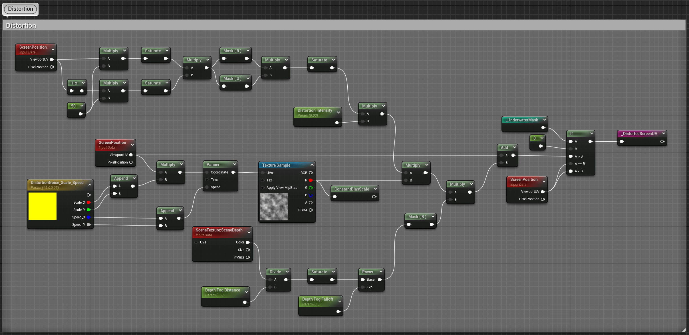
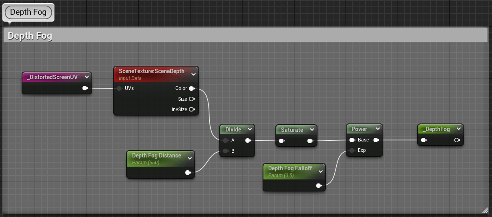
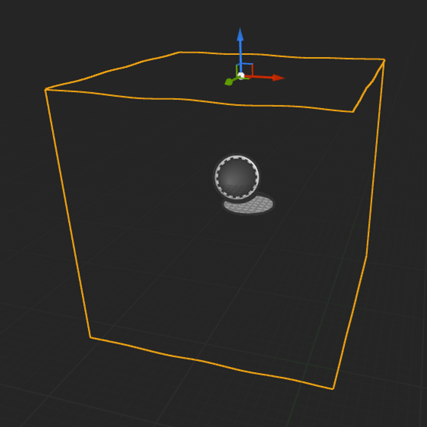

    <h1>Water - Underwater Effects</h1>
    
 

    
This section covers the visual and technical underwater effects used to simulate the experience of being submerged in water. From distortion, viggnetting, depth fog, blur, to waterline and underwater view of surface, the effects are designed to create an immersive underwater environment in Unreal Engine.

    

      <picture>
          <source srcset="media/preview.webp" type="image/webp">
          
      </picture>
    

## Table of Contents <!-- omit from toc -->
- [Key Features](#key-features)
- [Investigation](#investigation)
- [Implementation Details](#implementation-details)
  - [Post Process Volume](#post-process-volume)
  - [Vignetting](#vignetting)
  - [Distortion](#distortion)
  - [Blur](#blur)
  - [Depth Fog](#depth-fog)
  - [Waterline](#waterline)
    - [Underwater Mask](#underwater-mask)
    - [Waterline Mask](#waterline-mask)
  - [Underwater View of Water Surface](#underwater-view-of-water-surface)
- [Future Work](#future-work)
- [References](#references)

## Key Features
- Underwater Distortion: Simulates light distortion caused by water movement.
- Vignetting: Adds darkened edges to enhance the feeling of depth and immersion.
- Depth Fog: Realistically represents how water depth affects the visibility and lighting.
- Waterline Effect: Smooth transition between above-water and underwater views.
- Underwater View of Surface: Simulates the view from underwater looking up at the water surface.

## Investigation
The main area of investigation was how to effectively implement the waterline. I explored three different solutions:

1. SceneCaptureComponent2D Method: This method involved placing a box with its top surface aligned with the water surface and enclosing the underwater area. The box had an outer black and inner white surface. A SceneCaptureComponent2D captured this box separately and wrote the result to a render target, producing the underwater mask. However, this approach incurred relatively high overhead due to the cost associated with using SceneCaptureComponent2D.

2. Stencil Test Method with Full Box: Another approach used a box with its bottom surface aligned with the water surface (stencil value 1) and a plane exactly at the water surface (stencil value 0). Using the stencil test, this method generated the underwater mask. The challenge here was that the box and plane had to match the water surface displacement. If the water area was large, this approach could lead to significant performance costs.

3. Dynamic Small Box with Stencil Test: This approach was similar to the second method using the stencil test, but involved a smaller box that didn’t cover the entire water area. Instead, the box was sized just enough to generate the mask within the camera's view and would dynamically move and rotate with the player. However, this method lacked the additional plane, causing abrupt changes in the mask when the height difference between the water surface and the camera exceeded a threshold, leading to less smooth transitions.

In the end, I had chosen a hybrid solution that combined the strengths of these methods. I used a smaller, localized box (stencil value 1) with its top surface aligned with the water and a small plane (stencil value 0) that overlapped with the box's top surface. This box moved and rotated with the player, and I used stencil testing to generate the underwater mask efficiently.

## Implementation Details

   

### Post Process Volume
A Post Process Volume had been placed in the scene and assigned the corresponding material instance, not set to unbound, with its volume confined to the underwater area.

### Vignetting
Based on the distance from the center of the screen to each pixel, an elliptical vignetting mask was calculated to darken the edges of the screen, emulating the natural light falloff seen in camera lenses. This effect enhanced the sense of immersion by subtly guiding the player's focus toward the center of the screen.

 

### Distortion
For underwater distortion, I used a noise texture to distort the screen-space UV coordinates. This created the illusion of visual distortion of objects caused by the water. I applied a mask to limit the distortion to the center of the screen, ensuring that the effect doesn't appear on the screen's edges, where sampling issues might occur. The distortion strength was controlled by scene depth, with closer objects being less distorted than those farther away.

  <picture>
    <source srcset="media/distortion.webp" type="image/webp">
    
  </picture>   
  

### Blur
To simulate the blurriness of underwater objects, I applied a Gaussian blur to the underwater scene, which enhanced the diffusing of light underwater.

     

### Depth Fog
Depth fog was essential for representing underwater visibility. I used scene depth to calculate the fog intensity, making distant objects appear hazy and obscured. The further an object was from the camera, the more it was affected by the fog, simulating how light diminishes in deep water.

    

### Waterline

  <picture>
    <source srcset="media/waterline.webp" type="image/webp">
    
  </picture> 
     
  

#### Underwater Mask
The underwater mask that differentiated between the above-water and underwater regions was created using a stencil buffer. I used two separate meshes in a blueprint actor: one smaller, localized box (stencil value 1) with its top surface aligned with the water and one small plane (stencil value 0) that overlapped (a small offset to avoid Z-fighting) with the box's top surface. By enabling stencil testing, I was able to generate a black-and-white mask, where areas above water are 0 and areas below water are 1. The actor were set to dynamically follow the character’s movement and rotation using a blueprint, ensuring that the mask accurately updated as the player's view changed when entering or exiting the water.

     

#### Waterline Mask
To achieve the waterline effect, I applied a blur to the underwater mask and then multiplied the original mask by its inverse (1-x), creating a smooth transition area where the waterline was located. The width and sharpness of the waterline were controlled by adjustable parameters, allowing for fine-tuning based on the desired visual style.

### Underwater View of Water Surface
I simulated the underwater view of the surface by placing a plane with normals facing downwards and using the same displacement and normal maps with the water surface material to mimic the water surface's behavior from underneath. A simple HDR texture resembling the sky was used, and the vignetting mask was also applied here to enhance the brightness in the center and darken the edges.

 

## Future Work
One area of improvement will be the addition of ray marching for underwater volumetric lighting. Implementing this technique will enable more realistic light scattering and shafts of light penetrating through the water, and greatly enhance the visual immersion of underwater scenes by simulating how light interacts with particles in the water, creating a more dynamic and atmospheric effect.

## References
[1] https://www.youtube.com/watch?v=ZdTcFRrYpg8&list=TLPQMjAwOTIwMjQgXhoGhgKcBA&index=1

[2] https://www.youtube.com/watch?v=BNldzmlSvCA

[3] https://www.bilibili.com/video/BV1Ud4y1d78v/?spm_id_from=333.999

[4] https://www.bilibili.com/video/BV1hP4y1d7qY/?spm_id_from=333.788
