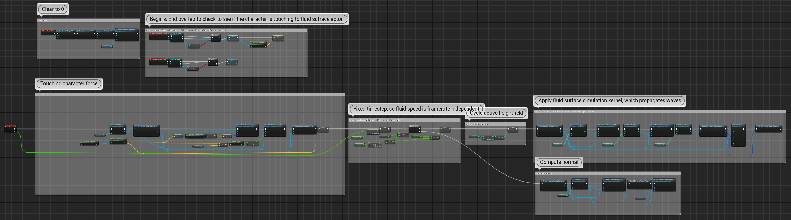
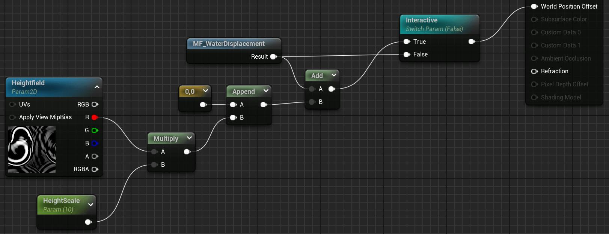

    <h1>Water - Water Intereaction</h1>
    
 

    
This section focuses on how water interacts with both the environment and the character, including dynamic caustics, foam, wetting effects, and character-driven water interactions like wave generation and lens water droplets upon emergence from water.

    
 

## Table of Contents <!-- omit from toc -->
- [Key Features](#key-features)
- [Investigation](#investigation)
  - [Caustics](#caustics)
  - [Water Droplets on Lens](#water-droplets-on-lens)
  - [Interactive Wave Simulation](#interactive-wave-simulation)
- [Implementation Details](#implementation-details)
  - [Environment - Caustics](#environment---caustics)
  - [Environment - Foam](#environment---foam)
  - [Environment - Wetting for Surrounding Objects](#environment---wetting-for-surrounding-objects)
  - [Character - Procedurally Generated Water Droplets and Drips on Lens upon Emergence from Water](#character---procedurally-generated-water-droplets-and-drips-on-lens-upon-emergence-from-water)
  - [Character - Interactive Wave Simulation](#character---interactive-wave-simulation)
- [Future Work](#future-work)
- [References](#references)

## Key Features
- Dynamic Caustics and Foam: Real-time caustics under water and foam effects near the shore.
- Wetting for Surrounding and Underwater Objects: Decal-based wetting effects for both nearby objects and those underwater, providing realistic dampening.
- Procedurally Generated Water Droplets: Water droplets and drips appear on the camera lens when emerging from water, simulating the experience of transitioning from underwater to above water.
- Interactive Wave Simulation: Character-driven wave simulation that responds to movement through water, creating dynamic ripples and splashes.

## Investigation

### Caustics
Initially, I implemented caustics using a post-process approach, but this method didn’t allow the caustics to be visible above the water. I then considered using a light function to project caustics, but in my small scene, caustics didn’t need to dynamically change with the light source’s movement, making light functions an unnecessary performance cost. As a result, I chose to implement caustics using dynamically updated decals, which offer more control over the visual effect without the overhead of dynamic lighting.

### Water Droplets on Lens
For the water droplets effect when emerging from water, I initially used texture maps where different channels represented different attributes of the droplets (e.g., normals, speeds, etc.). However, this approach did not produce a natural result.

I then turned to ShaderToy, where I found an example of procedural raindrops on glass using noise. By adapting this approach to Unreal Engine, I achieved more natural-looking, procedurally generated water droplets that interacted with the lens.

### Interactive Wave Simulation
For the interactive wave simulation, I studied techniques used for interactive snow with render targets and applied similar principles to my water simulation. I adapted the wave simulation method from Unreal Engine’s ExampleContent, which calculates water wave height and normal maps in real time, then incorporated this simulation result into my own water material to create dynamic waves that respond to character interactions.

## Implementation Details

### Environment - Caustics
Caustics were implemented using a decal-based method. I used world coordinates as the sampling base, with the normal direction determining which two channels of the world coordinate to sample the caustic maps. This approach helps avoid stretching on steep surfaces that use only XY channels. Noise is applied to disturb the sampling coordinates. Additionally, I used a parameter to control the offset of the RGB sampling coordinates, creating a dispersion effect. Two caustic textures with different scales and speeds are sampled, and their results are combined and multiplied by a caustics color. An extra parameter controls the vertical strength of the caustic effect for proper projection onto sloped surfaces.

    

### Environment - Foam
Foam was created by using the built-in Motion_4WayChaos function with a custom foam texture. The foam intensity is multiplied by a foam color and blended based on water depth, so foam only appears in shallow water. This dynamic foam effect responds to wave movements and adds detail where water interacts with the environment, such as along shorelines or near obstacles.

     

### Environment - Wetting for Surrounding Objects
To simulate wetting effects for both nearby and underwater objects, I utilized decals. The decals project a black base color, with roughness set to 0 and a specular value of 0.1 to simulate a wet surface. An elliptical mask with edge falloff controled the transition between wet and dry areas. The intensity of the wetting effect was controlled via opacity, allowing for different levels of dampness depending on the object’s proximity to the water.

    

### Character - Procedurally Generated Water Droplets and Drips on Lens upon Emergence from Water
For the water droplets effect, I reproduced the approach on ShaderToy in UE. Due to limitations of the `Custom` node (which did not allow function definitions), the core water droplet generation algorithm and supporting functions (such as noise) were moved to a .usf file and registered via C++ for `Include File Paths` of the `Custom` node.

  

In the `Custom` node, the main function processes UV calculations, and different droplet types (static and dripping). The .usf functions are called to generate droplet height, normals, and trailing effects. A timer was included to slowly evaporate the droplets in several seconds.

    

### Character - Interactive Wave Simulation
I modified the example blueprint from Unreal Engine’s ExampleContent package to reuse its simulation results of height and normal data, render them to render targets, and update the texture parameters in the dynamic material instance of my water surface based on the character's position, creating ripples and waves that respond to movement.

       

## Future Work
- Expanding Water Area
    - Dynamic Canvas Updates of Render Targets: Dynamically updating the render target's drawing range and results based on the character's position. This can allow for seamless water interactions in larger environments.
    - Light-Responsive Caustics: Transitioning from decal-based caustics to a system that responds to light source movement and intensity, creating more dynamic and realistic lighting effects in underwater scenes.

- Wave-Responsive Wetness: Currently, the wetness effect is static, not responding to wave positions. In future updates, I plan to implement a more dynamic system where wetness depth adjusts based on the location and intensity of waves interacting with objects.

- Dynamic Water Droplets: The water droplets on the lens currently only appear once after emerging from the water. I have not yet found a method to make droplets dynamically appear and disappear based on the waterline’s position in real time, and I plan to investigate further to achieve this effect.

## References
[1] https://www.youtube.com/watch?v=QhOGsNg7Ly4

[2] https://www.youtube.com/watch?v=VMpXSEomAAk

[3] https://www.youtube.com/watch?v=olk41batGSA

[4] https://www.bilibili.com/video/BV1RP4y1d7JM/?spm_id_from=333.788

[5] https://www.shadertoy.com/view/DdKyR1

[6] https://www.youtube.com/watch?v=jfXJYPTdyAg

[7] https://www.bilibili.com/video/BV1PR4y1Z74e/?spm_id_from=333.788

[8] https://www.bilibili.com/video/BV1YY41197mK/?spm_id_from=333.788