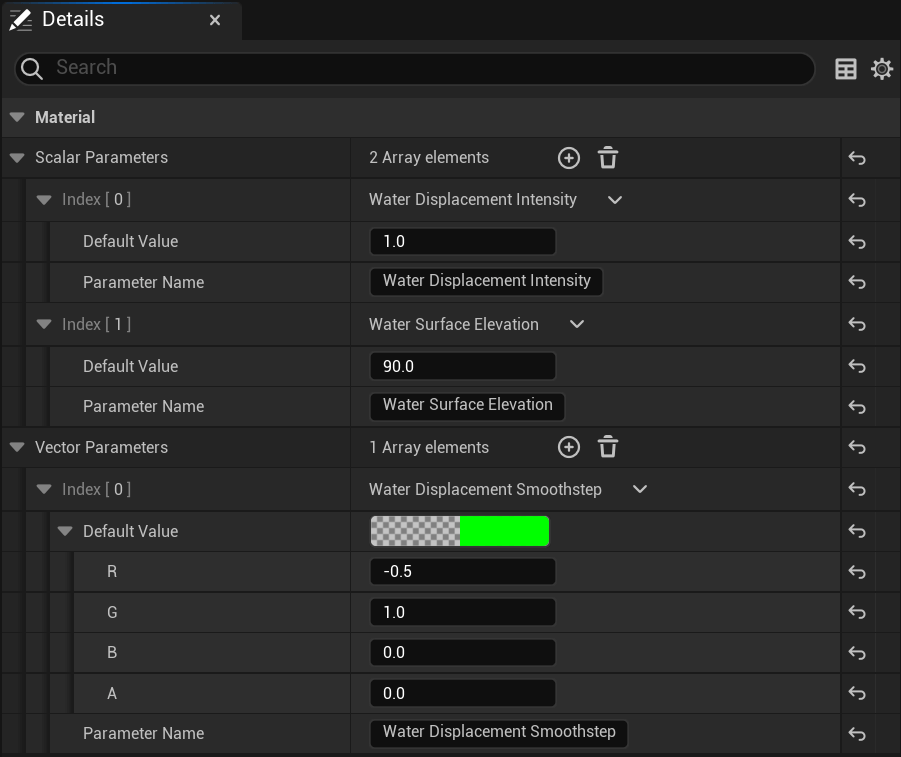
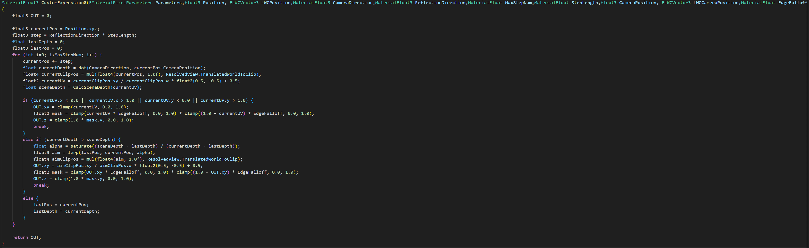
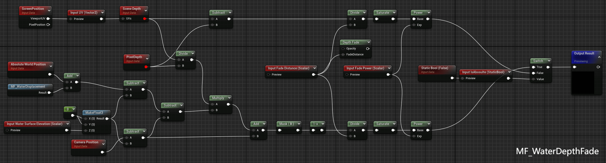

    <h1>Water - Water Surface</h1>
    
 

    
This section covers the implementation of a realistic water surface, including waves, reflections, refraction, specular lighting, and depth handling using various techniques in Unreal Engine.

    
 

## Table of Contents <!-- omit from toc -->
- [Key Features](#key-features)
- [Investigation](#investigation)
- [Implementation Details](#implementation-details)
  - [Virtual Heightfield Mesh](#virtual-heightfield-mesh)
  - [Waves](#waves)
    - [Normal Disturbance](#normal-disturbance)
    - [Surface Displacement](#surface-displacement)
  - [Reflection](#reflection)
    - [Screen-Space Reflection](#screen-space-reflection)
    - [Custom HDR Reflection](#custom-hdr-reflection)
  - [Refraction](#refraction)
  - [Depth Fade](#depth-fade)
    - [Absolute Water Depth Fade](#absolute-water-depth-fade)
    - [Scene Depth Fade](#scene-depth-fade)
  - [Fresnel](#fresnel)
  - [Specular Lightning](#specular-lightning)
- [Future Work](#future-work)
- [References](#references)

## Key Features
- Dynamic Waves: Combining normal disturbance and surface displacement to create natural wave motion.
- Combined Reflections: Implementing both screen-space reflections (SSR) to capture the surrounding environment and overlaying custom HDR reflections to compensate for areas outside screen space.
- Efficient Refraction: Using noise to distort screen-space sampling for refraction to optimize performance.
- Depth-Based Effects: Multiple depth calculations to control shading and refraction intensity.
- Specular Highlights: Simulating lighting interactions on an unlit material to produce convincing water highlights.

## Investigation
Initially, I experimented with using the Lit material in Unreal Engine. However, I found that it offered limited artistic control over the visual aesthetics, and the results were not appealing. Additionally, the built-in SSR effect provided by the Lit material could not be adjusted, which made it difficult to fine-tune the reflections to my liking. The refraction method that used pixel normal offset also consumed significant performance resources, making it impractical for real-time rendering.

As a result, I decided to switch to an Unlit material to gain more control over the visual look. I implemented a custom SSR effect in HLSL to allow more flexibility, and instead of relying on the built-in refraction system, I used noise-based screen-space refraction. This approach offered a better balance between aesthetic flexibility and performance.

## Implementation Details

    

### Virtual Heightfield Mesh
I utilized the Virtual Heightfield Mesh for dynamic water surface displacement. This allowed for intelligent subdivision of the surface mesh, providing finer control over the displacement for wave simulation without sacrificing performance.

     

### Waves
- #### Normal Disturbance
  The normal disturbance from waves was driven by two different normal maps: a base normal for large-scale wave movements and a detailed ripple normal map for fine surface details. By blending these two normal maps and controlling their UV scales and speeds, I was able to create a layered, dynamic water surface with different wave patterns.
  
   

- #### Surface Displacement
  Using built-in noise functions, the world position offset was applied based on the wave normal. This displacement generated realistic surface movements and enhanced the dynamic wave simulation.
  
   

### Reflection

    

- #### Screen-Space Reflection
  I implemented Screen-Space Reflections (SSR), ensuring that nearby objects, such as rocks and terrain, would be reflected on the water surface. Instead of relying on Unreal's built-in SSR, I opted for a custom implementation using a `Custom` node, allowing more control over the reflection and handling screen edge fading for a smoother transition.
  
    

- #### Custom HDR Reflection
  To address SSR's limitations in sampling content outside the screen, I added a Custom HDR Reflection layer utilizing an HDR texture that mimicked the dynamic sky. By combining this with SSR, the water surface could reflect both the immediate surroundings and the broader environment for a more comprehensive reflection.
  

### Refraction
Instead of using Unreal's built-in refraction system, I simulated refraction by distorting the screen-space UV coordinates using noise. This method, controlled by depth, created a convincing refractive effect that changed based on the water's depth, with stronger refraction in deeper areas.

   

### Depth Fade

- #### Absolute Water Depth Fade
  This part computed the object's distance to the water surface, which controlled refraction intensity and visual effects like shading variations across different depths.
  

- #### Scene Depth Fade
  Based on the calculation method of Unreal's `DepthFade` node but enhanced by incorporating refraction disturbance, this technique allowed for smooth interpolations between shallow and deep water.
  
    

### Fresnel
The Fresnel effect, calculated based on the dot product between the water surface normals and the view direction, was used to measure how the water reflects and refracts light based on the viewing angle.

    

### Specular Lightning
Since the material was unlit, I simplified the lighting by manually calculating specular highlights based on the light source direction and the view angle. This provided the illusion of proper lighting interactions without the overhead associated with a fully lit material.

    

## Future Work
- **Shadow Reception:** The current unlit material does not calculate or receive shadows from other objects. In the future, I plan to explore ways to implement shadow reception, allowing the water surface to properly reflect shadows cast by surrounding objects.
- **Dynamic Weather Integration:** Currently, the wave system is designed for general conditions, but integrating dynamic weather patterns (such as storms, calm water, and wind) would add realism. This could involve creating a system where wave intensity/patterns and surface displacement adapt to weather changes in real-time.
- **Real-Time Surface Detail Adaptation:** I will develop an LOD (Level of Detail) system that dynamically adjusts the water surface details based on the camera distance and angle. This will allow for higher levels of detail close to the player while optimizing performance for distant surfaces.

## References
[1] https://www.bilibili.com/video/BV1hP4y1d7qY/?spm_id_from=333.788

[2] https://www.bilibili.com/video/BV1Ud4y1d78v/?spm_id_from=333.999
