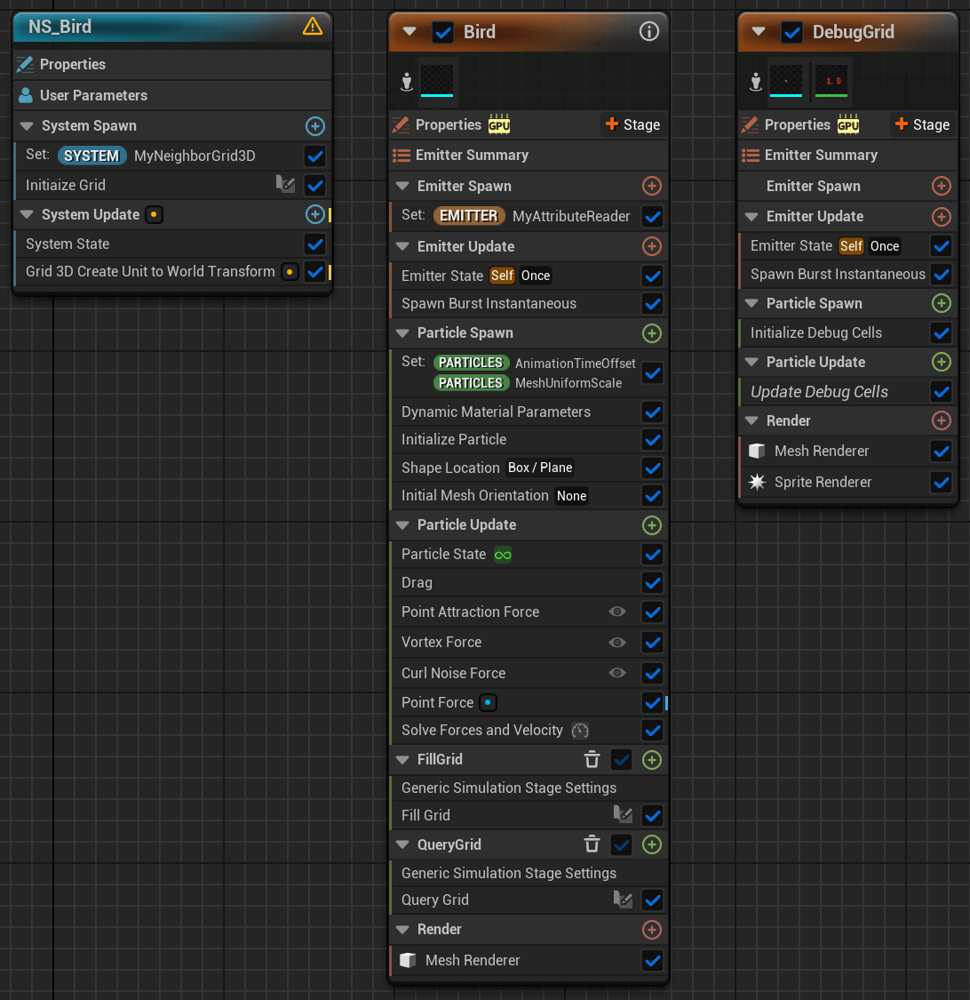

    <h1>Bird Flock System</h1>
    
 

    
This demo showcases a procedurally generated bird flock system using Unreal Engine's Niagara system. The birds are animated using vertex animation textures, with flocking behavior and spacing between individuals dynamically controlled through various forces and the Neighbor Grid 3D module.

    

      <picture>
          <source srcset="media/preview.webp" type="image/webp">
          
      </picture> 
      <picture>
        <source srcset="media/debug.webp" type="image/webp">
        
      </picture>
    

## Table of Contents <!-- omit from toc -->
- [Inspiration](#inspiration)
- [Key Features](#key-features)
- [Investigation](#investigation)
  - [Animation](#animation)
  - [Particle Spacing](#particle-spacing)
- [Implementation Details](#implementation-details)
  - [Vertex Animation for Static Mesh](#vertex-animation-for-static-mesh)
  - [Niagara System](#niagara-system)
    - [Flock Behavior Simulation](#flock-behavior-simulation)
    - [Maintaining Particle Spacing](#maintaining-particle-spacing)
- [Future Work](#future-work)
- [References](#references)

## Inspiration
Flocking behavior is a common element in many game scenes, whether it's fish schools, bird flocks, insect swarms, or other special effects. It combines fundamental particle effects with more advanced techniques to make the motion and behavior feel believable. This blend of simplicity and complexity offers a valuable learning opportunity, allowing for further exploration into realistic simulations and particle systems.

## Key Features
- Vertex animation textures reducing the performance cost of skeleton-based animation.
- Realistic flocking behavior driven by a combination of forces, including repulsion, attraction, and vortex movement.
- Particle spacing managed by the Neighbor Grid 3D module to prevent overlap between birds and create a natural formation.

## Investigation
### Animation
One of the key issues with rendering a large number of birds with skeletal animations was the performance overhead. Since instancing was not supported for skeletal meshes, rendering a large number of animated birds would require many draw calls, which was not scalable for this kind of simulation. To address this, I investigated the process of converting skeletal animations into vertex animation textures (VAT), which allows static meshes to be animated using textures. By baking the animation data into textures, we could achieve a similar visual effect while taking advantage of instancing and significantly reducing draw calls.

### Particle Spacing
To simulate a natural flock, it was important to ensure that the birds maintain a certain distance from each other, avoiding overcrowding. After exploring various techniques, I found that the Neighbor Grid 3D module in Unreal's Niagara system provides an efficient solution. This system helped detect the proximity of particles (birds) to their neighbors and adjust their position accordingly to maintain a realistic separation. By controlling this distance, I could simulate a more believable flock where individual birds dynamically adjust their spacing to avoid collisions.

## Implementation Details

### Vertex Animation for Static Mesh
The process of converting skeletal animations into vertex animations involved enabling Unreal’s `AnimToTexture` plugin. A data asset was created to store the texture-based animation, which was then linked to the bird models. Using the `BP_AnimToTexture` blueprint, I extracted the skeleton animation data and stored it in textures. The animated data was then applied to static meshes through a custom material, driving vertex movement to simulate wing-flapping.

     

### Niagara System

  

#### Flock Behavior Simulation
- Flocking behavior was created using multiple forces within the Niagara system:
  - Vortex Force: To create swirling, dynamic flock movements, a vortex force was added.
    

  - Drag Force: A drag force was applied to simulate air resistance and keep the birds’ movements within a controlled range.
    

  - Repulsion and Attraction: A sine-driven moving point force was used to simulate repulsion, pushing the birds apart, while a directional force simulated attraction towards a central point to maintain the flock's cohesion.
    
 

  - Curl Noise Force: This force added random, swirling motion to mimic the natural, chaotic movement of birds in a flock.
    

- To add realism, I also introduced randomness to each bird’s wing-flapping animation. Using a dynamic material parameter called `AnimationTimeOffset`, each particle was assigned a random value between 0 and 1, which controlled the starting frame of the wing animation. This avoided that birds flapped their wings in perfect unison, to create a more natural look.
  
    

#### Maintaining Particle Spacing
By adding Neighbor Grid 3D module, I could track the proximity of each bird to its neighbors and maintain proper spacing between.
- Grid Setup: A grid was established with a limit of max neighbors per cell. Two simulation stages were added: 
  - Fill Grid to add particles within the grid
    

  - Query Grid to check the distance of neighbors within the grid. If a bird had neighbors too close, its position and velocity was adjusted accordingly to maintain the necessary distance.
    
   

- Debugging: To visualize the grid and neighbor count during the flock simulation, I created a new emitter that rendered both cube meshes and text sprites. The cube meshes served as visual representations of the grid cells, helping to understand how the birds were distributed across the grid; The text sprites displayed the neighbor count for each cell, providing real-time feedback on how many birds were within each cell, aiding in adjusting particle spacing parameters.
  

    <picture>
      <source srcset="media/debug.webp" type="image/webp">
      
    </picture> 
    
  

  - A custom Scratch Pad script was developed to dynamically adjust the size, position, and rotation of the cube mesh based on the grid’s dimensions and cell count. This script also calculated the neighbor count for each cell and updated the dynamic material parameters accordingly.
    
   

  - Cube Mesh Material: The opacity of the cube mesh was adjusted based on the neighbor count for each cell. Cells with fewer particles were rendered more transparent, allowing for easier identification of sparsely populated areas.
    

  - Text Sprite Material: The sprite rendered the neighbor count as text, allowing easy visualization of the number of particles in each grid cell.
    

  
  This setup provided crucial visual cues for debugging and fine-tuning the flock's behavior.

## Future Work
In addition to the current flying behavior, the system could be expanded to include more diverse actions, such as idle, walking, takeoff, and landing. These behaviors could dynamically shift based on environmental factors and player interaction. For example, birds resting on the ground could take flight when the player approaches, adding a layer of realism and immersion to the scene.

## References
[1] 3D model "Flying Bird" (https://skfb.ly/6CpMO) by sandeep.s is licensed under Creative Commons Attribution (http://creativecommons.org/licenses/by/4.0/).

[2] https://youtu.be/PyB2KlWXTf8?si=FCNxlXm4O3btxqOP

[3] https://youtu.be/uGaJpS3LaS4?si=qJhg9ul69OZ9I8yH

[4] https://www.chrismccole.com/blog/creating-ambient-birds-in-unreal-with-niagara-and-vertex-animations-continued-advanced

[5] https://youtu.be/82asza6Kv24?si=h1sTZTaujz8M8f75
