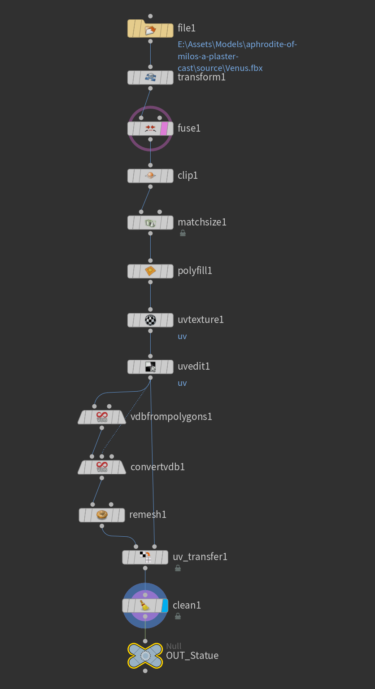

    <h1>Statue Destruction Effect</h1>
    
 

    
This project features a directional statue destruction effect, where fragments of the statue break apart, rotate, and fly away. It was created using procedural fracturing in Houdini and vertex animation as well as cinematic lighting in Unreal Engine, aimed at achieving breakage without physical simulations.

    

      <picture>
        <source srcset="media/preview.webp" type="image/webp">
        
      </picture> 
    

## Table of Contents <!-- omit from toc -->
- [Inspiration](#inspiration)
- [Key Features](#key-features)
- [Investigation](#investigation)
- [Implementation Details](#implementation-details)
  - [Model Processing](#model-processing)
  - [Fracturing and Data Storage (Pre-baking Pivot Points)](#fracturing-and-data-storage-pre-baking-pivot-points)
  - [Vertex Animation](#vertex-animation)
  - [Lighting and Color Grading](#lighting-and-color-grading)
  - [Animation and Rendering](#animation-and-rendering)
- [Future Work](#future-work)
- [References](#references)

## Inspiration
This project was inspired by a YouTube video demonstrating a sculpture destruction simulation in Houdini [1]. The effect was impressive, and it reminded me of a tutorial I had seen on using vertex animations to create a ground-shattering effect in Unity [2]. That gave me the idea to challenge myself by recreating the sculpture destruction effect without physical simulations, instead relying on vertex animations in Unreal Engine.

   
  <picture>
    <source srcset="media/inspiration2.webp" type="image/webp">
    
  </picture> 

## Key Features
- Directional destruction effect driven by vertex animation with dynamic rotation and displacement, instead of simulation
- Procedural fracture patterns with customizable debris size and density based on proximity to the explosion point
- Lighting and volumetric fog to enhance the cinematic effect

## Investigation
- **Model Fracturing:** Initially, I considered not using a statue and instead planned to fracture a model of Cloud's Buster Sword from Final Fantasy, but encountered issues when applying a Voronoi fracture. The unexpected geometry errors led me to test various methods to troubleshoot, including:
   - Increasing the mesh resolution by converting to a denser triangular mesh
   - Switching from surface scattering to volume scattering for fracture points
   - Breaking the model into smaller sections and fracturing them individually with `for each`.
   - Trying alternative fracture methods, such as RBD Material Fracture and Edge Fracture
   - After realizing the root cause was non-watertight geometry, I tested converting the model to a watertight mesh using VDB. However, this process caused detail loss. I also attempted merging the model's topology in Blender with `Union`, but it would require time-consuming manual fixes.
  
  In the end, I decided to abandon the sword model and chose a statue as my main asset.

- **Storing Fracture Information:** For the vertex animation, I needed to each fragment's centroid (pivot point). I explored options to store this data in either UV channels or vertex colors. I opted to use UVs since Unreal supports up to 8 UV channels, while the vertex color only provide 4 channels, even though my project didn't exceed 4 channels.

- **Vertex Animation for Destruction:** I followed the tutorial on using vertex animation to simulate the ground destruction effect of the Hammer of Dawn in Gears of War [2], which divides the vertex displacement into Z component and XY component. From that, I learned to split the fragment's movement into axial (along the explosion axis) and radial (perpendicular) components, for a controlled, directional destruction effect.

## Implementation Details

### Model Processing
The original full-body statue model was clipped to a half-body bust. UV mapping was carefully handled, and The mesh was remeshed using the VDB conversion to create a watertight model with better topology.

 

### Fracturing and Data Storage (Pre-baking Pivot Points)
The statue was fractured non-uniformly based on proximity to the explosion point, with smaller and denser pieces near the blast point. To achieve the directional explosion effect, I used a `PyroSource` node to generate points within a sphere at the explosion center, jittered the points and deleted points not in the statue. The remaining points were used to guide the RBD Material Fracture, creating smaller, denser fragments near the explosion point. The uneven fracture cross-sections were controlled through parameters in the Detail tab of the fracture node.

  

Centroid Data Storage: I packed the pieces, storing the centroid coordinates in the UV channels (XY in the first two channels of UV1, Z in the first channel of UV2), and also stored the distance from each centroid to the sphere center (explosion center) in the second channel of UV2. This allowed for controlled animation during the destruction sequence later.

### Vertex Animation
The centroid coordinates and distance values were unpacked from the UV channels in the material. Except different coordinate axes of Hounidi and Unreal Engine, another tricky point was that the Y-axis in their UV coordinates is inverted. When importing the model as an FBX into Unreal, it automatically performed a 1-Y flip on the UVs. Since we were using UVs to store custom data, not actual texture coordinates, we had to manually apply another 1-Y flip within the material to restore the original Houdini values. I initially overlooked this step, which caused unnecessary time-wasting. Additionally, to ensure the centroid position was correctly unpacked, I also created a debug visualization method—displacing the vertices toward their respective centroids for verification.

 

A 0-1 scalar parameter, Destruction Progress, controlled the overall directional destruction progress, determining how far along each piece was in the destruction sequence based on its distance from the explosion center.

     
  
     
  <picture>
    <source srcset="media/overall_destruction_progress.webp" type="image/webp">
    
  </picture>

- Rotation: Each fragment’s centroid acted as the pivot for rotation, with a random rotation axis generated using noise. The rotation speed was tied to the destruction progressof each fragment—fragments with a higher progress, which break earlier and are generally smaller, rotated faster to create a more dynamic breaking effect.
  

     
    <picture>
      <source srcset="media/rotation_angle.webp" type="image/webp">
      
    </picture> 
    <picture>
      <source srcset="media/rotation_exponent.webp" type="image/webp">
      
    </picture>
  

- Displacement
  

  - Axial Displacement: Displacement along the explosion axis was calculated by multiplying each fragment’s destruction progress (shaped by a `pow` function) by the primary axial direction of the explosion and noise. To simulate the effect of gravity near the end of the sequence, I referenced a method from the ground destruction tutorial, using the first part of a sine wave to create a slightly falling effect.
    

      <picture>
      <source srcset="media/axial_scale.webp" type="image/webp">
      
      </picture> 
      <picture>
      <source srcset="media/axial_exponent.webp" type="image/webp">
      
      </picture>
    

  - Radial Displacement: As fragments were propelled along the axial direction, they also moved radially away from the explosion axis. This was done by scaling their position offset in relation to the axial axis using their destruction progress (again shaped by a `pow` function) combined with noise, giving the fragments a natural scattering motion as they flew apart.
    

      <picture>
      <source srcset="media/radial_scale.webp" type="image/webp">
      
      </picture> 
      <picture>
      <source srcset="media/radial_exponent.webp" type="image/webp">
      
      </picture> 
    

### Lighting and Color Grading
Volumetric fog and lighting were carefully adjusted to enhance the atmospheric destruction effect, with several cubes placed to block directional light and create the desired fog shape. Two rect lights were positioned to subtly highlight the statue from specific angles. Color grading was adjusted in post-processing to fine-tune the overall tone and mood.

  

### Animation and Rendering
A Sequencer was created to animate the destruction by keyframing the parameters of the vertex animation within a Material Parameter Collection. The final destruction animation was rendered using the Movie Render Queue.

## Future Work
- Refined Fracture Details: Improving the fracture detail, especially in cross-sections, and making smaller fragments more intricate.
- Baking Simulated Destruction: Experimenting with simulating the destruction in Houdini and baking it into VAT (Vertex Animation Textures) for a more physically accurate animation in Unreal Engine, bypassing the in-engine vertex animation calculations.

## References
[1] https://youtu.be/rQ0D87SH5PE?si=GDNmiGKz_a1Lpsmx

[2] https://lexdev.net/tutorials/case_studies/gears_hammerofdawn.html

[3] https://www.bilibili.com/video/BV1n1421Q77R

[4] https://www.bilibili.com/video/BV1Gf421D7Wz
